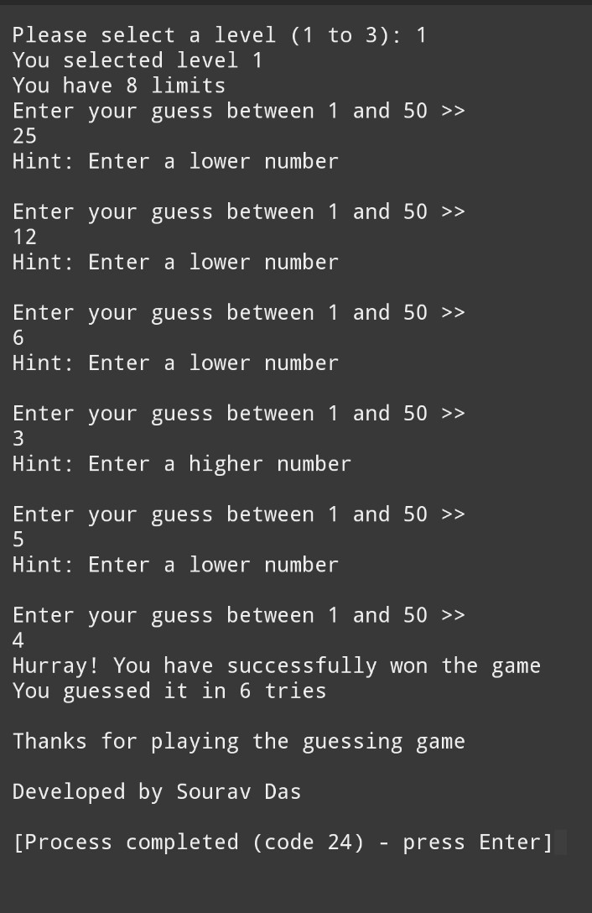
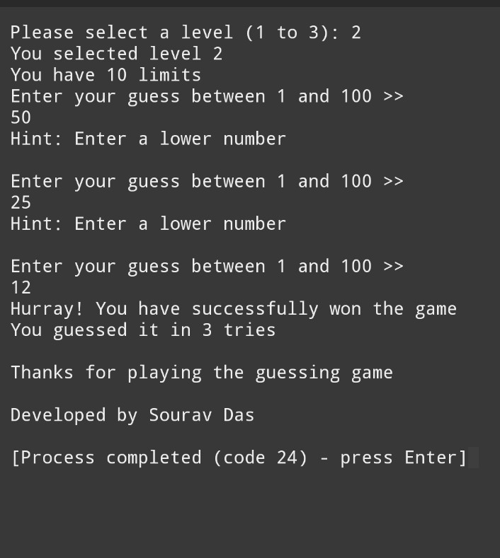
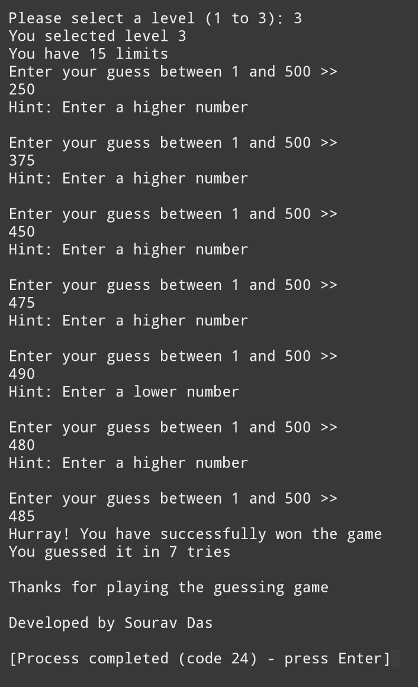
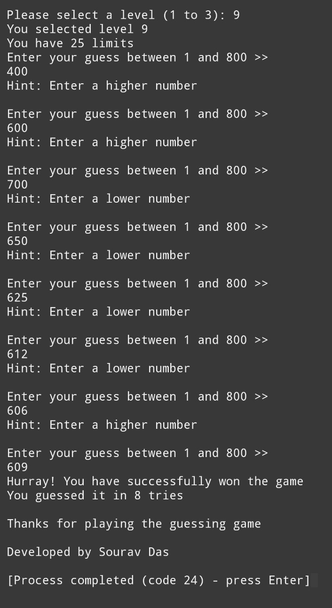
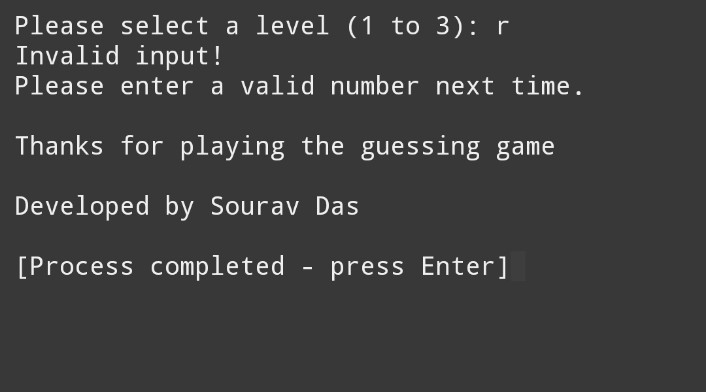
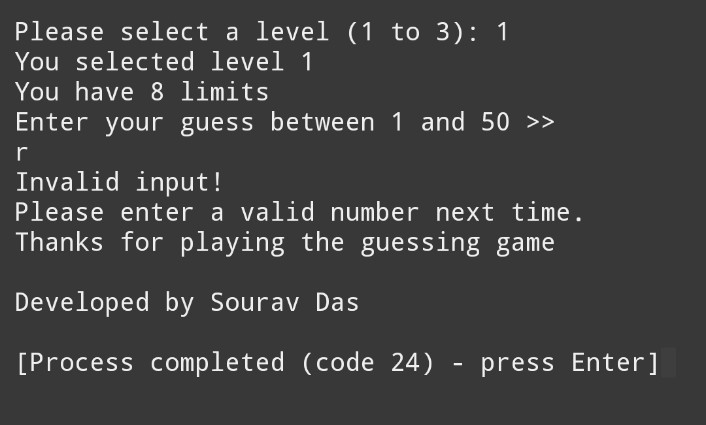

---

# Number Guessing Game in C

---

About

This is a simple number guessing game built using C.
Players can select different difficulty levels and try to guess the random number within a limited number of attempts.
The program gives hints if the guess is too high or too low.

---
## 📸 Sample Screenshots

###  Level 1

### Level 2

### Level 3

### Another level

### Limit Error

### Input Error

---

Features

Difficulty Levels:

Level 1 → Number between 1–50 (8 attempts)

Level 2 → Number between 1–100 (10 attempts)

Level 3 → Number between 1–500 (15 attempts)

Any other input → Number between 1–800 (25 attempts)

Random number generation with time.h

Input validation (detects invalid inputs)

Hint system (higher or lower)

Displays number of attempts on winning

Friendly messages and game end credits

---

How to Run

> Make sure you have GCC or any C compiler installed.

1. Clone the repository:

git clone https://github.com/Sourav5482/guessing-game-c.git
cd guessing-game-c

2. Compile the code:

gcc -o guessing_game guessing_game.c

3. Run the game:

./guessing_game

---

GuessGameUsingC/
│
├── guessGame.c
├── README.md
├── Screenshots/
│   ├── level1.jpg
│   ├── level2.jpg
│   ├── level3.jpg
│   ├── levelX.jpg
│   ├── limitError.jpg
│   └── inputError.jpg

## 🙌 Author

- **Sourav Das**
- 📧 Portfolio: [sourav5482.github.io](https://sourav5482.github.io/Portfolio/)

---

## 📜 License

This project is licensed under the MIT License - feel free to use and modify it.

